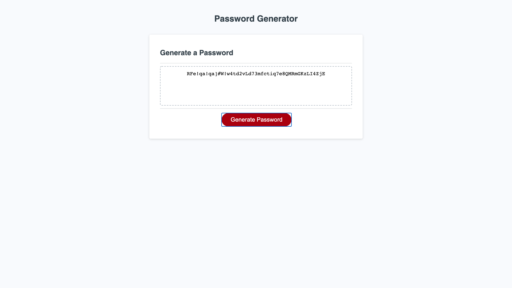

# Kevin_Pulley



>  Welcome to my about me page!

---

### Table of Contents

- [Description](#description)
- [How To Use](#how-to-use)
- [References](#references)
- [License](#license)
- [Author Info](#author-info)

---
## Acceptance Criteria


```
GIVEN I need a new, secure password
WHEN I click the button to generate a password
THEN I am presented with a series of prompts for password criteria
WHEN prompted for password criteria
THEN I select which criteria to include in the password
WHEN prompted for the length of the password
THEN I choose a length of at least 8 characters and no more than 128 characters
WHEN prompted for character types to include in the password
THEN I choose lowercase, uppercase, numeric, and/or special characters
WHEN I answer each prompt
THEN my input should be validated and at least one character type should be selected
WHEN all prompts are answered
THEN a password is generated that matches the selected criteria
WHEN the password is generated
THEN the password is either displayed in an alert or written to the page
```

## Description

This is a random password generator that chooses length, and what to include in the password (numbers, characters, etc...)

#### Technologies

- HTML
- CSS
- JavaScript
- Bootstrap
- Markdown
- Visual Studio Code

[Back To The Top](#Kevin_Pulley)

---

## How To Use
- Visit https://kevin-pulley.github.io/Password-Generator/

#### Installation
- Google Chrome or any Web Browser


[Back To The Top](#Kevin_Pulley)

---

## References
- http://www.youtube.com
- http://www.github.com
- http://www.w3schools.com
- Vandy Coding Bootcamp


[Back To The Top](#Kevin_Pulley)

---

## License

MIT License

Copyright (c) [2020] [Kevin S Pulley]

Permission is hereby granted, free of charge, to any person obtaining a copy
of this software and associated documentation files (the "Software"), to deal
in the Software without restriction, including without limitation the rights
to use, copy, modify, merge, publish, distribute, sublicense, and/or sell
copies of the Software, and to permit persons to whom the Software is
furnished to do so, subject to the following conditions:

The above copyright notice and this permission notice shall be included in all
copies or substantial portions of the Software.

THE SOFTWARE IS PROVIDED "AS IS", WITHOUT WARRANTY OF ANY KIND, EXPRESS OR
IMPLIED, INCLUDING BUT NOT LIMITED TO THE WARRANTIES OF MERCHANTABILITY,
FITNESS FOR A PARTICULAR PURPOSE AND NONINFRINGEMENT. IN NO EVENT SHALL THE
AUTHORS OR COPYRIGHT HOLDERS BE LIABLE FOR ANY CLAIM, DAMAGES OR OTHER
LIABILITY, WHETHER IN AN ACTION OF CONTRACT, TORT OR OTHERWISE, ARISING FROM,
OUT OF OR IN CONNECTION WITH THE SOFTWARE OR THE USE OR OTHER DEALINGS IN THE
SOFTWARE.

[Back To The Top](#Kevin_Pulley)

---

## Author Info

- Email - [skippy1025@gmail.com](skippy1025@gmail.com)
- Github - [github.com/Kevin-Pulley]

[Back To The Top](#Kevin_Pulley)

